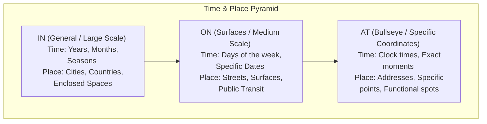

# Prepositions of Time & Place: The Target Practice

> [!abstract] **The Concept in a Nutshell**
> Think of **in**, **on**, and **at** as a target. **In** is the outer ring (general, large scale). **On** is the middle ring (more specific, flat surfaces/days). **At** is the bullseye (precise times, exact coordinates). Master this target to place yourself perfectly in time and space!

---

## Scene Study (Real-World Dialogue)
> [!example] **Meeting at the Station**
> **Max:** "Where are you? I've been waiting **at** the station entrance since 5 o'clock."
> **Chloe:** "I'm **on** the train! I'll be there **in** ten minutes. I'm sitting **in** the second carriage."
> **Max:** "Okay. Let's meet **at** the coffee shop **on** the corner."

---

## The Blueprint (Form & Structure)

### 1. Prepositions of Time
- **IN:** *in 2026, in summer, in October, in the morning* (large intervals).
- **ON:** *on Friday, on October 25th, on New Year's Day* (days & dates).
- **AT:** *at 6:30 PM, at noon, at midnight, at the moment* (exact moments).
  * *Exception:* **at night** (even though we say *in the morning/afternoon*).

### 2. Prepositions of Place
- **IN:** *in London, in France, in the room, in the pool* (boundaries & areas).
- **ON:** *on the table, on the wall, on Oxford Street, on the bus* (surfaces & lines).
- **AT:** *at the bus stop, at the door, at 10 Downing Street, at home/work/school* (points & targets).

---

## Mnemonic & Memory Hacks
> [!tip] **The "Stand-Up Transit" Rule & The Pyramid**
> - **Transit Test**: If you can **stand up and walk** inside the vehicle, use **on** (*on a bus, on a train, on a plane*). If you have to **crouch down and sit** immediately, use **in** (*in a car, in a taxi*).
> - **Scale Pyramid**: Think of `In` as a big bowl, `On` as a flat plate, and `At` as a pinhead. 

---

## Interactive Flashcards (Spaced Repetition)
- Which preposition do we use for streets (e.g., "Wall Street")? :: on (e.g., "on Wall Street")
- Which preposition do we use for full addresses (e.g., "11 Wall Street")? :: at (e.g., "at 11 Wall Street")
- Correct this: "I will see you on last Sunday." :: "I will see you last Sunday." (Do not use prepositions of time before 'last', 'next', 'this', or 'every').

---

## The Trap (Common Mistakes)
> [!danger] **Avoid the Blunder!**
> - **The Mistake:** *"I was born in 12th April."*
> - **The Fix:** *"I was born **on** 12th April."*
> - **Why?:** A month alone takes *in* (*in April*), but the moment a day is added, it becomes a specific date, which requires *on*.

---

## Related Topics
- [[English/02_Parts_of_Speech/relative_prepositions_dependent|Dependent Prepositions]]
- [[English/02_Parts_of_Speech/nouns_countable_uncountable|Countable & Uncountable Nouns]]
