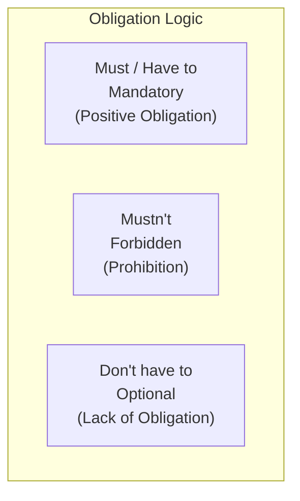

# Modals of Ability, Permission & Obligation

> [!abstract] **The Concept in a Nutshell**
> Modal verbs are the traffic controllers of English. They don't express actions themselves, but they tell us how actions should happen: Are they mandatory? Forbidden? Optional? Or are you capable of doing them? Master the modals to navigate the laws of speech!

---

## Scene Study (Real-World Dialogue)
> [!example] **The Security Desk**
> **Officer Aria:** "Stop! You **must not** enter this server room without a badge."
> **Max:** "But I **have to** fix the database. **Can** I go in just for a minute?"
> **Officer Aria:** "No, but you **don't have to** go in yourself. You **should** leave the drive here. You **ought to** know the safety protocols!"

---

## The Blueprint (Form & Structure)

### 1. Ability (What you are capable of)
- **can (present):** *I **can** write code.*
- **could (past):** *I **could** run fast when I was a child.*
- **be able to (all tenses):** Used when normal modals cannot be used (e.g. future/perfect).
  * *I **will be able to** help you tomorrow.*
  * *I **have been able to** log in.*

### 2. Permission (What you are allowed to do)
- **can (informal):** ***Can** I borrow your pen?*
- **could (polite):** ***Could** I ask you a question?*
- **may (formal):** ***May** I see your passport?*

### 3. Obligation & Necessity (What is required)
- **must (internal obligation / speaker's choice):** *I **must** exercise more.*
- **have to (external obligation / rules & circumstances):** *We **have to** submit the tax forms by Friday.*
- **don't have to (optional / lack of necessity):** *You **don't have to** dress formally; it's a casual party.*

### 4. Prohibition (What is forbidden)
- **must not / mustn't:** *You **mustn't** share your passwords.* (Completely forbidden).

### 5. Advice & Suggestions (What is recommended)
- **should / ought to:** *You **should** get some sleep.* / *You **ought to** back up your files.*

---

## Mnemonic & Memory Hacks
> [!tip] **The "Traffic Light" Rules & The Past Obligation**
> - **Mustn't (Red Light)**: A hard wall. DO NOT DO IT. (E.g. *You mustn't jump.*).
> - **Don't Have to (Green Light with caution)**: No obligation. You choose. (E.g. *It's free, you don't have to pay, but you can donate.*).
> - **Must vs. Have to**: `Must` is **inside** (your thoughts/feelings). `Have to` is **outside** (laws, boss, situations).
> - **Had to**: *Must* has no past tense form! If you want to say you had an obligation yesterday, use **had to** (*"I had to study last night"*).

---

## Interactive Flashcards (Spaced Repetition)
- What is the past form of "must" when expressing obligation? :: had to (e.g., "I had to leave early yesterday").
- What is the difference between "mustn't" and "don't have to"? :: "Mustn't" means it is forbidden/not allowed. "Don't have to" means it is optional/not necessary.
- Correct this: "We must to follow the rules." :: "We must follow the rules." (Do not use 'to' after modal verbs).

---

## The Trap (Common Mistakes)
> [!danger] **Avoid the Blunder!**
> - **The Mistake:** *"You don't have to park in front of the emergency exit."*
> - **The Fix:** *"You **must not** park in front of the emergency exit."*
> - **Why?:** *Don't have to* means optional (you can do it if you want). Parking in front of an emergency exit is illegal and dangerous, so it requires *must not* (prohibition).

---

## Related Topics
- [[English/05_Modals/modals_speculation_past|Modals of Speculation & Past Modals]]
- [[English/05_Modals/gerunds_and_infinitives|Gerunds and Infinitives]]
