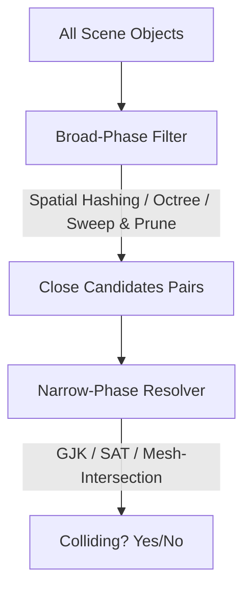

# Collision Detection: Broad-Phase Spatial Partitioning and Narrow-Phase GJK

> [!abstract] **The Concept in a Nutshell**
> Collision detection is the process of identifying when two or more objects in a game world intersect. Because checking every object against every other object (an $O(N^2)$ operation) quickly stalls the CPU, collision systems are divided into two phases: **Broad-Phase** (which quickly filters out distant objects using spatial division and bounding boxes) and **Narrow-Phase** (which performs precise mathematical intersection checks, like the **GJK algorithm**, on the remaining close candidates).

---

## Game Dev Context (Why This Matters)
> [!example] **Scene: Simulating a City with $10{,}000$ Physics Objects**
> Imagine an open-world sandbox game with $10{,}000$ physics-enabled trash cans, boxes, cars, and characters.
>
> If you perform a naive check comparing every object with every other object:
> $$\text{Checks} = \frac{N(N-1)}{2} \approx 50{,}000{,}000 \text{ checks per frame}$$
> This would crash the game instantly.
>
> To solve this, the physics engine runs a **Broad-Phase** spatial partition (like a 3D grid or Octree). It divides the city into smaller districts. If a trash can is in District A and a car is in District B, the engine skips checking them. Only objects inside the *same* grid cell are sent to the **Narrow-Phase** for precise triangle-level collision checks.

---

## The Blueprint (Formula & Structure)



### 1. Broad-Phase Algorithms
Designed to eliminate obvious non-collisions as fast as possible.
- **Sweep and Prune (SAP):** Projects bounding boxes onto the coordinates axes (usually X, Y, or Z) and sorts the endpoints. Overlaps are detected by scanning the sorted list, which is highly efficient for mostly static scenes.
- **Spatial Hashing:** Divides 2D or 3D space into a grid of uniform cells. Each object is registered in cells based on its coordinates. We only check objects sharing the same grid cells.
- **Octree / BVH (Bounding Volume Hierarchy):** Tree structures that recursively subdivide space into boxes.

### 2. Narrow-Phase Algorithms
Designed to check if two shapes are actually intersecting and find the contact point.
- **Separating Axis Theorem (SAT):** Checks if there is any line along which the projections of two convex shapes do not overlap. If such a line exists, the shapes do not collide.
- **GJK (Gilbert-Johnson-Keerthi) Algorithm:** A highly efficient algorithm for checking collisions between convex shapes in 3D. It operates on the **Minkowski Difference** ($\vec{A} \ominus \vec{B}$) of the two shapes. If the Minkowski Difference shape contains the origin $(0,0,0)$, the shapes are overlapping.

---

## Building Intuition (Visual Understanding)
> [!tip] **Mental Model: The File Cabinet and the Ruler**
> - **Broad-Phase** is like filing documents into cabinet drawers: you label drawers by letter. If you need a file on "Smith," you don't search the drawers labeled A through R.
> - **Narrow-Phase** is like taking the files out of the "S" drawer and using a ruler to check if two photos are overlapping on the table.

---

## Code Example (Applied in Engine)

```csharp
// Unity C# — Simulating a 2D Spatial Hash Grid for Broad-Phase Collision
using System.Collections.Generic;
using UnityEngine;

public class SpatialHashCollision : MonoBehaviour
{
    public float cellSize = 2f;
    private Dictionary<Vector2Int, List<Collider2D>> grid = new Dictionary<Vector2Int, List<Collider2D>>();

    // Convert world position to grid cell coordinates
    private Vector2Int GetCellCoords(Vector2 position)
    {
        return new Vector2Int(
            Mathf.FloorToInt(position.x / cellSize),
            Mathf.FloorToInt(position.y / cellSize)
        );
    }

    // Register colliders into grid cells
    public void RegisterCollider(Collider2D col)
    {
        Vector2Int minCell = GetCellCoords(col.bounds.min);
        Vector2Int maxCell = GetCellCoords(col.bounds.max);

        for (int x = minCell.x; x <= maxCell.x; x++)
        {
            for (int y = minCell.y; y <= maxCell.y; y++)
            {
                Vector2Int cellKey = new Vector2Int(x, y);
                if (!grid.ContainsKey(cellKey))
                {
                    grid[cellKey] = new List<Collider2D>();
                }
                grid[cellKey].Add(col);
            }
        }
    }

    // Perform broad-phase check (only check contacts within the same cells)
    public void CheckCollisions()
    {
        foreach (var cell in grid.Values)
        {
            if (cell.Count < 2) continue;

            // Run narrow-phase checks ONLY on objects in the same cell
            for (int i = 0; i < cell.Count; i++)
            {
                for (int j = i + 1; j < cell.Count; j++)
                {
                    Collider2D a = cell[i];
                    Collider2D b = cell[j];

                    // Narrow-phase check (built-in physics engine check)
                    if (a.Distance(b).isOverlapping)
                    {
                        // Collision detected! Resolve it.
                    }
                }
            }
        }
    }

    void LateUpdate()
    {
        grid.Clear(); // Clear grid every frame to re-evaluate moving objects
    }
}
```

---

## Interactive Flashcards (Spaced Repetition)
- What is the difference between broad-phase and narrow-phase collision detection? :: Broad-phase quickly filters out distant objects using spatial partitioning ($O(N \log N)$), while narrow-phase runs precise geometric tests on remaining nearby object pairs.
- What mathematical concept does the GJK algorithm rely on? :: The **Minkowski Difference** ($\vec{A} \ominus \vec{B}$), which subtracts the coordinates of shape B from shape A.
- How does the GJK algorithm know if two convex shapes are colliding? :: If the resulting Minkowski Difference convex hull contains the origin point $(0,0,0)$.
- What is Spatial Hashing? :: A broad-phase partitioning technique that divides space into a grid of cells and assigns objects to cells using coordinates keys.
- What is Sweep and Prune? :: A broad-phase technique that projects bounding volumes onto coordinate axes and checks for overlaps along those sorted lists.

---

## Common Pitfalls (The Trap)
> [!danger] **Watch Out!**
> - **The Mistake:** Using complex mesh colliders for moving debris or particles.
> - **The Fix:** Simplify debris colliders to Spheres or simple boxes, keeping mesh colliders reserved for static scenery (terrain, buildings).
> - **Why:** Running narrow-phase checks on moving complex mesh colliders is incredibly taxing. Using primitive bounding shapes keeps the physics engine running at high framerates.

---

## Related Topics
- [[Math/07_Geometric_Primitives/bounding_volumes|Bounding Volumes]]
- [[Math/07_Geometric_Primitives/intersection_testing|Intersection Testing]]
- [[Math/10_Physics_Math/collision_response|Collision Response]]
